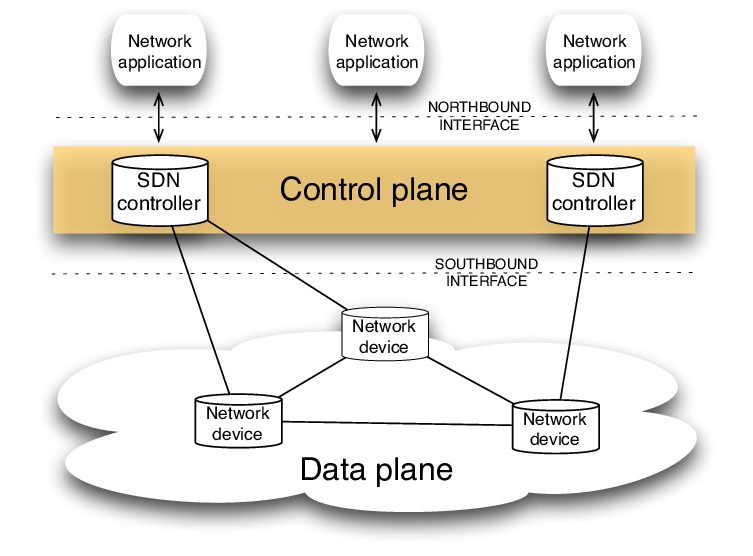

# Intent Based Networking Optimization for evolving networks
Intent Based Network Optimization Test Bench setup for AI network Analysis and Optimization based on Raspberry Pi and ESP32 

We want to create a test bench that can help us acheive intent based networking and to aid understanding of how sub millisecond latency optimizations can work 

  

The Control Layer is the place where the policy agumentation takes place and algorithm runs i.e Raspberry Pi 5 
